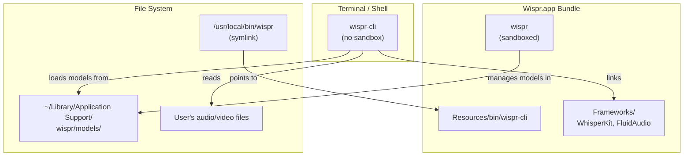
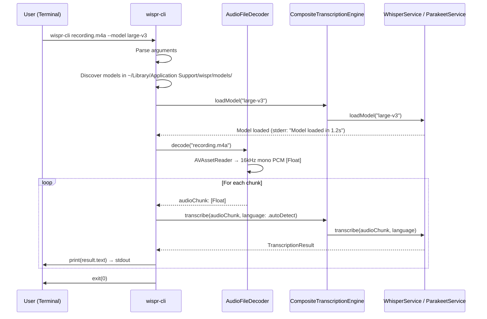

# Design Document: Command-Line Transcription Tool

## Overview

This design adds a standalone command-line tool (`wispr-cli`) embedded in the Wispr application bundle. The CLI decodes audio/video files into PCM samples using AVFoundation, loads transcription models from the shared model directory, and prints transcribed text to stdout. It reuses the same transcription engine code as the GUI app but runs outside the sandbox with Hardened Runtime only.

The implementation adds one new Xcode target, one new source file (`AudioFileDecoder`), one new source file (`CLI/main.swift`), and modifies the GUI app's menu to offer CLI installation. Existing transcription engine code is shared between targets via Xcode target membership.

| File | Change |
|---|---|
| `wispr-cli/main.swift` | **New file** — CLI entry point, argument parsing, orchestration |
| `wispr/Services/AudioFileDecoder.swift` | **New file** — AVAssetReader-based audio decoding to `[Float]` |
| `wispr/UI/MenuBarController.swift` | Add "Install Command Line Tool..." menu item |
| `wispr/UI/CLIInstallDialog.swift` | **New file** — SwiftUI dialog showing the install command |
| Xcode project | New `wispr-cli` command-line tool target with shared source membership |

## Alternatives Considered (Not Selected for Phase A)

### Alternative 1: Client-Server IPC via Unix Domain Socket

**Approach:** The CLI is a thin client that sends file paths to the running GUI app over a Unix domain socket at `~/Library/Application Support/wispr/wispr.sock`. The GUI app performs decoding and transcription, streaming results back.

**Why not selected:**
- Requires the GUI app to be running — a CLI tool that fails when the app isn't open is a poor user experience.
- Adds IPC protocol design complexity (message framing, error propagation, cancellation).
- Sandboxed app creating and listening on a Unix domain socket needs validation — the socket path must be in a sandbox-accessible location, and behavior may vary across macOS versions.
- Doubles the latency for short files (IPC round-trip + processing vs. direct processing).

**When it would be appropriate:** Phase B, as an optimization for users who keep the GUI running. The CLI could try connecting to a socket first (models already loaded = no cold start) and fall back to standalone mode. This hybrid approach is strictly additive and does not affect the Phase A design.

### Alternative 2: XPC Service for Shared Transcription

**Approach:** Extract transcription into an XPC service (`com.stormacq.mac.wispr.transcription`) that both the GUI app and CLI talk to. The XPC service manages model lifecycle and performs transcription.

**Why not selected:**
- XPC services inside sandboxed app bundles inherit the sandbox — the XPC service cannot read arbitrary file paths either, so the CLI would still need to read and pipe audio data.
- Significant architectural refactoring to extract transcription into a separate process.
- `SMAppService` registration and Mach service naming add deployment complexity.
- Overkill for Phase A where the CLI can simply load models directly.

**When it would be appropriate:** If the app grows to support multiple concurrent clients (e.g., Shortcuts integration, Automator actions) that all need shared model lifecycle management.

### Alternative 3: Homebrew Distribution

**Approach:** Distribute the CLI as a separate Homebrew formula or cask post-install stanza, installed to `/usr/local/bin/wispr` automatically.

**Why not selected:**
- Adds an external distribution channel to maintain alongside direct download / App Store.
- CLI binary must still be signed and notarized — distributing outside the app bundle means a separate notarization workflow.
- Versioning must stay in sync between the GUI app and CLI.
- Does not conflict with Phase A — can be added later as an additional installation method.

**When it would be appropriate:** When the app has a Homebrew cask; the cask's `postflight` stanza can create the symlink automatically.

### Alternative 4: Privileged Helper for Symlink Creation

**Approach:** Use `SMAppService.daemon(plistName:)` to install a privileged helper that creates the `/usr/local/bin/wispr` symlink on behalf of the sandboxed app, avoiding the copy-paste command.

**Why not selected:**
- Extremely heavy machinery for creating a single symlink.
- Requires a launchd plist, a separate helper binary, and elevated privilege authorization UI.
- Users installing developer tools from Terminal are comfortable running a single `ln -s` command.
- The copy-to-clipboard UX (VS Code-style) is well understood and sufficient.

## Architecture

### Build Architecture

```
wispr.xcodeproj
├── Target: wispr (Application)
│   ├── Entitlements: App Sandbox + Hardened Runtime
│   ├── Sources: wispr/**/*.swift
│   └── Frameworks: WhisperKit, FluidAudio
│
├── Target: wispr-cli (Command Line Tool)
│   ├── Entitlements: Hardened Runtime only (NO sandbox)
│   ├── Sources: wispr-cli/main.swift
│   ├── Shared Sources (target membership):
│   │   ├── Services/AudioEngine.swift (subset — not needed)
│   │   ├── Services/WhisperService.swift
│   │   ├── Services/ParakeetService.swift
│   │   ├── Services/CompositeTranscriptionEngine.swift
│   │   ├── Services/TranscriptionEngine.swift
│   │   ├── Services/AudioFileDecoder.swift (NEW — both targets)
│   │   ├── Models/ModelInfo.swift
│   │   ├── Models/TranscriptionResult.swift
│   │   ├── Models/TranscriptionLanguage.swift
│   │   ├── Models/ModelStatus.swift
│   │   ├── Models/WisprError.swift
│   │   └── Utilities/ModelPaths.swift
│   ├── Frameworks: WhisperKit, FluidAudio
│   └── Embed in: wispr.app/Contents/Resources/bin/
│
├── Target: wisprTests
└── Target: wisprUITests
```

### Runtime Architecture



### Data Flow: CLI File Transcription



## Components and Interfaces

### 1. AudioFileDecoder

A new actor that decodes audio/video files into PCM float samples using AVFoundation. Shared between the CLI and GUI targets.

```swift
/// Decodes audio/video files into 16 kHz mono PCM Float32 samples
/// suitable for transcription engines.
///
/// Uses AVAssetReader for decoding — supports all formats that
/// AVFoundation/CoreAudio can handle (MP3, WAV, M4A, FLAC, AAC,
/// MP4, MOV, etc.) with no additional dependencies.
actor AudioFileDecoder {

    /// Decoded audio metadata returned alongside samples.
    struct AudioMetadata: Sendable {
        let duration: TimeInterval
        let sampleRate: Double
        let channelCount: Int
        let estimatedSampleCount: Int
    }

    /// Returns metadata about the audio track without decoding.
    func metadata(for fileURL: URL) async throws -> AudioMetadata

    /// Decodes the entire audio track into a single [Float] buffer.
    /// Suitable for short files (< 30 seconds).
    func decode(fileURL: URL) async throws -> [Float]

    /// Decodes the audio track in chunks, yielding fixed-size
    /// segments via AsyncStream. Suitable for long files.
    ///
    /// Each chunk contains `chunkDuration` seconds of audio at
    /// 16 kHz mono (default: 30 seconds = 480,000 samples).
    /// The last chunk may be shorter.
    func decodeChunked(
        fileURL: URL,
        chunkDuration: TimeInterval = 30.0
    ) -> AsyncThrowingStream<[Float], Error>
}
```

**Implementation notes:**
- Creates `AVAsset` from the file URL, reads the first audio track.
- Configures `AVAssetReaderTrackOutput` with output settings: `kAudioFormatLinearPCM`, 16000 Hz, 1 channel, Float32.
- For `decodeChunked`, reads sample buffers incrementally and yields when the chunk threshold is reached — keeps memory usage bounded regardless of file length.
- Throws descriptive errors for: file not found, no audio track, unsupported format, read failure.

### 2. CLI Entry Point (`wispr-cli/main.swift`)

The CLI entry point uses Swift's `ArgumentParser`-style manual parsing (no external dependency) to keep the binary lean.

```swift
/// wispr-cli entry point.
///
/// Usage:
///   wispr-cli <file> [--model <name>] [--language <code>] [--verbose]
///   wispr-cli --list-models
///   wispr-cli --help
///   wispr-cli --version
@main
struct WisprCLI {
    static func main() async throws {
        let args = parseArguments(CommandLine.arguments)

        switch args.command {
        case .help:
            printUsage()
        case .version:
            printVersion()
        case .listModels:
            try await listModels()
        case .transcribe(let config):
            try await transcribe(config)
        }
    }
}
```

```swift
struct TranscribeConfig: Sendable {
    let filePath: String
    let modelName: String?
    let languageCode: String?
    let verbose: Bool
}
```

**Argument parsing implementation:**
- Manual parsing of `CommandLine.arguments` — no dependency on `swift-argument-parser` to keep the binary small and avoid adding a dependency to the GUI app target.
- Validates file existence early (before model loading) to fail fast.
- Reads `activeModelName` from `UserDefaults(suiteName: nil)` for the default model (same UserDefaults domain as the GUI app since both run as the same user).

### 3. CLI Transcription Orchestration

```swift
/// Core transcription flow for the CLI.
func transcribe(_ config: TranscribeConfig) async throws {
    let fileURL = URL(fileURLWithPath: config.filePath)

    // 1. Resolve model
    let modelName = try resolveModel(config.modelName)
    if config.verbose {
        printStderr("Using model: \(modelName)")
    }

    // 2. Load model
    let engine = CompositeTranscriptionEngine(
        engines: [WhisperService(), ParakeetService()]
    )
    let startLoad = ContinuousClock.now
    try await engine.loadModel(modelName)
    if config.verbose {
        let elapsed = ContinuousClock.now - startLoad
        printStderr("Model loaded in \(elapsed)")
    }

    // 3. Get file metadata
    let decoder = AudioFileDecoder()
    let meta = try await decoder.metadata(for: fileURL)
    if config.verbose {
        printStderr("Audio duration: \(meta.duration)s")
    }

    // 4. Decode and transcribe
    let language: TranscriptionLanguage = config.languageCode
        .map { .specific(code: $0) } ?? .autoDetect

    if meta.duration <= 30.0 {
        // Short file — single-shot transcription
        let samples = try await decoder.decode(fileURL: fileURL)
        let result = try await engine.transcribe(samples, language: language)
        print(result.text)
    } else {
        // Long file — chunked transcription
        let chunks = decoder.decodeChunked(fileURL: fileURL)
        var chunkIndex = 0
        for try await chunk in chunks {
            chunkIndex += 1
            if config.verbose {
                printStderr("Transcribing chunk \(chunkIndex)...")
            }
            let result = try await engine.transcribe(chunk, language: language)
            if !result.text.isEmpty {
                print(result.text)
            }
        }
    }
}
```

### 4. Model Discovery

```swift
/// Resolves which model to use, in priority order:
/// 1. Explicit --model flag
/// 2. GUI app's active model from UserDefaults
/// 3. Smallest downloaded model
func resolveModel(_ explicitName: String?) throws -> String {
    let downloadedModels = discoverDownloadedModels()
    guard !downloadedModels.isEmpty else {
        throw CLIError.noModelsDownloaded
    }

    if let name = explicitName {
        guard downloadedModels.contains(where: { $0.name == name }) else {
            throw CLIError.modelNotFound(
                name,
                available: downloadedModels.map(\.name)
            )
        }
        return name
    }

    // Try GUI app's active model
    if let active = UserDefaults.standard.string(forKey: "activeModelName"),
       downloadedModels.contains(where: { $0.name == active }) {
        return active
    }

    // Fall back to smallest downloaded model
    return downloadedModels.sorted(by: { $0.sizeOnDisk < $1.sizeOnDisk }).first!.name
}

/// Scans the shared models directory for downloaded models.
func discoverDownloadedModels() -> [DownloadedModelInfo] {
    // Scans ~/Library/Application Support/wispr/models/
    // Each subdirectory with valid model files is a downloaded model
}

struct DownloadedModelInfo {
    let name: String
    let sizeOnDisk: Int64
    let path: URL
}
```

### 5. CLI Install Dialog (GUI App)

```swift
/// Dialog shown when user selects "Install Command Line Tool..." from the menu.
struct CLIInstallDialogView: View {
    let appBundlePath: String
    @Environment(\.dismiss) private var dismiss

    private var cliSourcePath: String {
        "\(appBundlePath)/Contents/Resources/bin/wispr-cli"
    }

    private var installCommand: String {
        "ln -s \"\(cliSourcePath)\" /usr/local/bin/wispr"
    }

    var body: some View {
        VStack(alignment: .leading, spacing: 16) {
            Text("Install Command Line Tool")
                .font(.headline)

            Text("Run this command in Terminal to make `wispr` available from any shell session:")

            GroupBox {
                Text(installCommand)
                    .font(.system(.body, design: .monospaced))
                    .textSelection(.enabled)
            }

            HStack {
                Button("Copy Command") {
                    NSPasteboard.general.clearContents()
                    NSPasteboard.general.setString(installCommand, forType: .string)
                }
                Spacer()
                Button("Done") { dismiss() }
            }
        }
        .padding()
        .frame(width: 500)
    }
}
```

### 6. MenuBarController Changes

Add a single menu item to the existing dropdown:

```swift
// In MenuBarController, inside menu construction
let installCLIItem = NSMenuItem(
    title: "Install Command Line Tool...",
    action: #selector(showCLIInstallDialog),
    keyEquivalent: ""
)
```

The action presents `CLIInstallDialogView` as a sheet or floating panel.

### 7. CLI Error Types

```swift
enum CLIError: Error, CustomStringConvertible {
    case noModelsDownloaded
    case modelNotFound(String, available: [String])
    case fileNotFound(String)
    case noAudioTrack(String)
    case unsupportedFormat(String)
    case decodingFailed(String)
    case transcriptionFailed(String)

    var description: String {
        switch self {
        case .noModelsDownloaded:
            "No models downloaded. Open Wispr.app and download a model first."
        case .modelNotFound(let name, let available):
            "Model '\(name)' not found. Available models: \(available.joined(separator: ", "))"
        case .fileNotFound(let path):
            "File not found: \(path)"
        case .noAudioTrack(let path):
            "No audio track found in: \(path)"
        case .unsupportedFormat(let path):
            "Unsupported file format: \(path)"
        case .decodingFailed(let detail):
            "Audio decoding failed: \(detail)"
        case .transcriptionFailed(let detail):
            "Transcription failed: \(detail)"
        }
    }
}
```

## Xcode Project Configuration

### wispr-cli Target Settings

| Setting | Value |
|---|---|
| Product Type | `com.apple.product-type.tool` (Command Line Tool) |
| Product Name | `wispr-cli` |
| Bundle Identifier | `com.stormacq.mac.wispr-cli` |
| Swift Language Version | 6 |
| Strict Concurrency | `complete` |
| `ENABLE_HARDENED_RUNTIME` | `YES` |
| `ENABLE_APP_SANDBOX` | `NO` |
| Deployment Target | macOS 26.2 |
| Frameworks | WhisperKit, FluidAudio |

### Embedding the CLI in the App Bundle

In the GUI app target's Build Phases:
1. Add a **Copy Files** phase with Destination: "Resources".
2. Set Subpath to `bin`.
3. Add the `wispr-cli` product as the file to copy.
4. Ensure "Code Sign On Copy" is checked.

This places the signed binary at `Wispr.app/Contents/Resources/bin/wispr-cli`.

### Shared Source Files

Source files shared between targets use Xcode's target membership (checked for both `wispr` and `wispr-cli` in the File Inspector). No new framework target or Swift Package is needed for Phase A.

Files with dual target membership:
- `Services/WhisperService.swift`
- `Services/ParakeetService.swift`
- `Services/CompositeTranscriptionEngine.swift`
- `Services/TranscriptionEngine.swift`
- `Services/AudioFileDecoder.swift`
- `Models/ModelInfo.swift`
- `Models/TranscriptionResult.swift`
- `Models/TranscriptionLanguage.swift`
- `Models/ModelStatus.swift`
- `Models/WisprError.swift`
- `Models/DownloadProgress.swift`
- `Utilities/ModelPaths.swift`
- `Utilities/Logger.swift`

Files **not** shared (GUI-only): `AudioEngine.swift`, `TextInsertionService.swift`, `HotkeyMonitor.swift`, `StateManager.swift`, `SettingsStore.swift`, all UI files.

## Data Models

No new data models are introduced for transcription. The CLI reuses all existing model types (`ModelInfo`, `TranscriptionResult`, `TranscriptionLanguage`, `ModelStatus`).

New types specific to the CLI:

```swift
/// Parsed CLI arguments.
enum CLICommand: Sendable {
    case help
    case version
    case listModels
    case transcribe(TranscribeConfig)
}

struct TranscribeConfig: Sendable {
    let filePath: String
    let modelName: String?
    let languageCode: String?
    let verbose: Bool
}

/// Metadata about a downloaded model discovered on disk.
struct DownloadedModelInfo: Sendable {
    let name: String
    let sizeOnDisk: Int64
    let path: URL
}
```

## Correctness Properties

### Property 1: Output isolation

*For any* invocation of wispr-cli, all diagnostic and progress messages SHALL be written to stderr. Only transcribed text SHALL be written to stdout. This ensures `wispr-cli recording.m4a > transcript.txt` produces a clean text file.

**Validates: Requirements 4.4, 4.5**

### Property 2: Model resolution determinism

*For any* combination of `--model` flag value, UserDefaults `activeModelName`, and set of downloaded models, the `resolveModel()` function SHALL return the same model name given the same inputs, following the priority order: explicit flag > UserDefaults > smallest downloaded.

**Validates: Requirements 3.2, 3.3, 3.4**

### Property 3: Chunked transcription completeness

*For any* audio file of duration D seconds, the concatenation of all chunk transcription outputs SHALL cover the entire audio content. No audio samples SHALL be skipped between chunks. The last chunk MAY be shorter than the configured chunk duration.

**Validates: Requirements 7.1, 7.2**

### Property 4: Memory boundedness for long files

*For any* audio file regardless of length, peak memory usage of the decode step SHALL be bounded by O(chunkDuration * sampleRate) rather than O(fileDuration * sampleRate). The full file SHALL NOT be loaded into memory at once when using chunked decoding.

**Validates: Requirements 7.4**

## Error Handling

| Scenario | Behavior | Exit Code |
|---|---|---|
| File not found | Print error to stderr | 1 |
| No audio track in file | Print error to stderr | 1 |
| Unsupported format | Print error to stderr | 1 |
| No models downloaded | Print error + instructions to stderr | 1 |
| Specified model not found | Print error + list available models to stderr | 1 |
| Model loading failure | Print error to stderr | 1 |
| Transcription failure | Print error to stderr | 1 |
| Successful transcription | Print text to stdout | 0 |

All errors are reported as human-readable messages on stderr. No stack traces or internal details are exposed unless `--verbose` is set.

## Testing Strategy

### Unit Tests

- **AudioFileDecoder**: Test decoding of each supported format (MP3, WAV, M4A, MP4, MOV) using short bundled test fixtures. Verify output is 16kHz mono Float32. Verify error cases (missing file, no audio track).
- **Model resolution**: Test all priority paths (explicit, UserDefaults, fallback). Test error when model not found. Test error when no models downloaded.
- **Argument parsing**: Test all flag combinations. Test missing arguments. Test `--help` and `--version` output.
- **Chunked decoding**: Verify chunk boundaries do not skip or duplicate samples. Verify last chunk handles remainder correctly.

### Integration Tests

- End-to-end test: provide a known audio file with known spoken content, run wispr-cli, verify stdout contains expected transcription (fuzzy match).
- Test piping: `wispr-cli test.wav | wc -w` produces non-zero word count.
- Test stderr isolation: redirect stdout to file, verify no diagnostic messages in the file.
