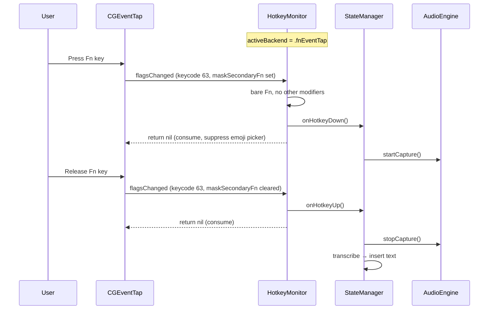

# Design Document: Fn Key as Hotkey (Issue #35)

## Overview

Add support for the Fn (Globe) key as a dictation hotkey by extending the existing `HotkeyMonitor` with an internal CGEventTap path. From the user's perspective, Fn is just another key you can press in the hotkey recorder. From the app's perspective, `HotkeyMonitor` is the only class to interact with — it picks the right mechanism (Carbon or CGEventTap) based on the registered keycode.

## Background: Why Fn Needs Special Handling

- Carbon's `RegisterEventHotKey` only supports Cmd, Opt, Ctrl, Shift as modifiers. Fn is invisible to this API.
- On Apple Silicon Macs, Fn doubles as the Globe key (default: opens emoji picker).
- `kVK_Function` (keycode 63) can only be intercepted via `CGEventTap` at the session level.
- SwiftUI's `.onKeyPress` does not receive Fn/Globe events, so the recorder needs `NSEvent.addLocalMonitorForEvents`.

## Key Design Decision: One Monitor, Two Backends

Instead of two separate monitor classes, `HotkeyMonitor` gains internal branching:

```
HotkeyMonitor.register(keyCode:modifiers:)
    │
    ├─ keyCode == 63 && modifiers == 0
    │   → setupFnEventTap()
    │
    └─ anything else
        → RegisterEventHotKey() (existing Carbon path)
```

**Why this is better than two classes:**
- `StateManager`, `wisprApp`, and settings observation code require zero changes
- No "which monitor is active" state to manage at the app level
- `updateHotkey()` seamlessly switches between Carbon ↔ CGEventTap
- `unregister()` / `deinit` clean up whichever is active
- The Fn key is just a hotkey with keycode 63 — no special "mode" concept

## Architecture

### HotkeyMonitor Changes

```swift
@MainActor
final class HotkeyMonitor {
    // Existing public API — unchanged
    var onHotkeyDown: (() -> Void)?
    var onHotkeyUp: (() -> Void)?
    func register(keyCode: UInt32, modifiers: UInt32) throws
    func unregister()
    func updateHotkey(keyCode: UInt32, modifiers: UInt32) throws
    func verifyRegistration() -> Bool
    func reregisterAfterWake()

    // New: which backend is active
    private enum ActiveBackend {
        case none
        case carbon(hotkeyRef: EventHotKeyRef, handlerRef: EventHandlerRef)
        case fnEventTap(machPort: CFMachPort, runLoopSource: CFRunLoopSource)
    }
    private var activeBackend: ActiveBackend = .none

    // New: Fn-specific state
    private var fnIsDown = false
    private var tapReEnableAttempts = 0
    private static let maxTapReEnableAttempts = 3

    // Sentinel for Fn key
    static let fnKeyCode: UInt32 = 63  // kVK_Function

    // New private methods
    private func setupFnEventTap() throws
    private func teardownFnEventTap()
    private func handleFnFlagsChanged(_ event: CGEvent) -> CGEvent?
}
```

### register() Branching Logic

```swift
func register(keyCode: UInt32, modifiers: UInt32) throws {
    unregister()

    // Check reserved shortcuts (existing)
    ...

    if keyCode == Self.fnKeyCode && modifiers == 0 {
        try setupFnEventTap()
    } else {
        try registerCarbonHotkey(keyCode: keyCode, modifiers: modifiers)
    }

    registeredKeyCode = keyCode
    registeredModifiers = modifiers
}
```

### CGEventTap Implementation

```swift
private func setupFnEventTap() throws {
    let eventMask = CGEventMask(1 << CGEventType.flagsChanged.rawValue)

    // C callback — only safe state is via the userData pointer
    let callback: CGEventTapCallBack = { proxy, type, event, userInfo in
        guard let userInfo else { return Unmanaged.passUnretained(event) }
        let monitor = Unmanaged<HotkeyMonitor>.fromOpaque(userInfo)
            .takeUnretainedValue()

        if type == .tapDisabledByTimeout {
            // System disabled our tap — re-enable it
            if let port = monitor.fnEventTapPort {
                CGEvent.tapEnable(tap: port, enable: true)
            }
            return Unmanaged.passUnretained(event)
        }

        if let result = monitor.handleFnFlagsChanged(event) {
            return Unmanaged.passUnretained(result)
        }
        return nil  // consume the event
    }

    let selfPtr = Unmanaged.passUnretained(self).toOpaque()

    guard let tap = CGEvent.tapCreate(
        tap: .cgSessionEventTap,
        place: .headInsertEventTap,
        options: .defaultTap,
        eventsOfInterest: eventMask,
        callback: callback,
        userInfo: selfPtr
    ) else {
        throw WisprError.hotkeyRegistrationFailed
    }

    let source = CFMachPortCreateRunLoopSource(nil, tap, 0)
    CFRunLoopAddSource(CFRunLoopGetMain(), source, .commonModes)
    CGEvent.tapEnable(tap: tap, enable: true)

    activeBackend = .fnEventTap(machPort: tap, runLoopSource: source!)
}
```

### Fn Event Filtering

```swift
private func handleFnFlagsChanged(_ event: CGEvent) -> CGEvent? {
    let keycode = event.getIntegerValueField(.keyboardEventKeycode)
    guard keycode == Int64(Self.fnKeyCode) else {
        return event  // not Fn, pass through
    }

    let flags = event.flags

    // Pass through if other modifiers are held (Fn+Cmd, Fn+Opt, etc.)
    let otherModifiers: CGEventFlags = [.maskCommand, .maskAlternate, .maskControl, .maskShift]
    if !flags.intersection(otherModifiers).isEmpty {
        return event
    }

    let isFnDown = flags.contains(.maskSecondaryFn)

    if isFnDown && !fnIsDown {
        fnIsDown = true
        onHotkeyDown?()
        return nil  // consume — suppress emoji picker
    } else if !isFnDown && fnIsDown {
        fnIsDown = false
        onHotkeyUp?()
        return nil  // consume
    }

    return event
}
```

### unregister() Cleanup

```swift
func unregister() {
    switch activeBackend {
    case .carbon(let hotkeyRef, let handlerRef):
        UnregisterEventHotKey(hotkeyRef)
        RemoveEventHandler(handlerRef)
    case .fnEventTap(let machPort, let runLoopSource):
        CGEvent.tapEnable(tap: machPort, enable: false)
        CFRunLoopRemoveSource(CFRunLoopGetMain(), runLoopSource, .commonModes)
    case .none:
        break
    }
    activeBackend = .none
    fnIsDown = false
    tapReEnableAttempts = 0
    registeredKeyCode = 0
    registeredModifiers = 0
}
```

### Wake Re-registration

The existing `handleSystemWake()` calls `verifyRegistration()` which calls `unregister()` + `register()`. This naturally works for both backends — if the Fn event tap went stale after sleep, it gets torn down and recreated.

### KeyCodeMapping Changes

```swift
// Add to keyNames
63: "🌐 Fn",

// No charToKeyCode entry needed — Fn is captured via NSEvent monitor,
// not SwiftUI .onKeyPress
```

### HotkeyRecorderView Changes

SwiftUI's `.onKeyPress` never fires for Fn/Globe. The recorder needs an `NSEvent` local monitor to detect it:

```swift
struct HotkeyRecorderView: View {
    // ... existing properties ...
    @State private var fnMonitor: Any?

    var body: some View {
        // ... existing body ...
        .onChange(of: isRecording) { _, recording in
            if recording {
                installFnMonitor()
            } else {
                removeFnMonitor()
            }
        }
    }

    private func installFnMonitor() {
        fnMonitor = NSEvent.addLocalMonitorForEvents(matching: .flagsChanged) { event in
            guard isRecording, event.keyCode == 63 else { return event }

            // Detect Fn press (not release)
            if event.modifierFlags.contains(.function) {
                keyCode = 63
                modifiers = 0
                isRecording = false
                errorMessage = nil
                return nil  // consume
            }
            return event
        }
    }

    private func removeFnMonitor() {
        if let monitor = fnMonitor {
            NSEvent.removeMonitor(monitor)
            fnMonitor = nil
        }
    }
}
```

The existing `handleKeyPress()` modifier guard (`carbonModifiers != 0`) stays unchanged — Fn is handled by the NSEvent monitor above, not by `.onKeyPress`, so it never reaches `handleKeyPress()`.

### Settings View: Globe Key Conflict Warning

When the hotkey is configured as Fn (keyCode 63, modifiers 0), the Settings view shows a contextual warning if the system Globe key conflicts:

```swift
// In SettingsView, below the hotkey recorder
if settingsStore.hotkeyKeyCode == HotkeyMonitor.fnKeyCode
    && settingsStore.hotkeyModifiers == 0 {
    let fnUsage = UserDefaults.standard.integer(forKey: "AppleFnUsageType")
    if fnUsage == 0 || fnUsage == 2 {
        // 0 = Emoji & Symbols (default), 2 = Character Viewer
        Label {
            Text("Your Globe key is set to open the emoji picker. ")
            + Text("Change it in System Settings → Keyboard → \"Press 🌐 key to\" → \"Do Nothing\".")
        } icon: {
            Image(systemName: "exclamationmark.triangle.fill")
                .foregroundStyle(.yellow)
        }
        .font(.caption)
    }
}
```

## Data Flow: Fn Key Recording Session



## Files to Modify

| File | Change |
|------|--------|
| `wispr/Services/HotkeyMonitor.swift` | Add `ActiveBackend` enum, CGEventTap setup/teardown, Fn event handling |
| `wispr/UI/Settings/KeyCodeMapping.swift` | Add keycode 63 → "🌐 Fn" to `keyNames` |
| `wispr/UI/Settings/HotkeyRecorderView.swift` | Add `NSEvent.addLocalMonitorForEvents` for Fn detection during recording |
| `wispr/UI/Settings/SettingsView.swift` | Add Globe key conflict warning (contextual, below hotkey recorder) |
| `wisprTests/HotkeyMonitorTests.swift` | Add tests for Fn registration path, backend switching |

No new files needed. No changes to `StateManager`, `wisprApp`, or `SettingsStore`.

## Risks and Mitigations

| Risk | Likelihood | Mitigation |
|------|-----------|------------|
| Emoji picker still opens despite consuming event | Low | Consume both press and release; test on Apple Silicon hardware |
| Event tap disabled by system timeout | Low | Callback is lightweight (flag check + closure call); auto re-enable |
| Fn+F-key combos broken | Medium if filter is wrong | Only consume when keycode == 63 AND no other modifiers held |
| NSEvent monitor in recorder misses Fn | Low | `.flagsChanged` reliably includes Fn; tested on macOS 26 |
| Switching Carbon ↔ CGEventTap on updateHotkey | Low | `unregister()` cleans up whichever is active before `register()` |
