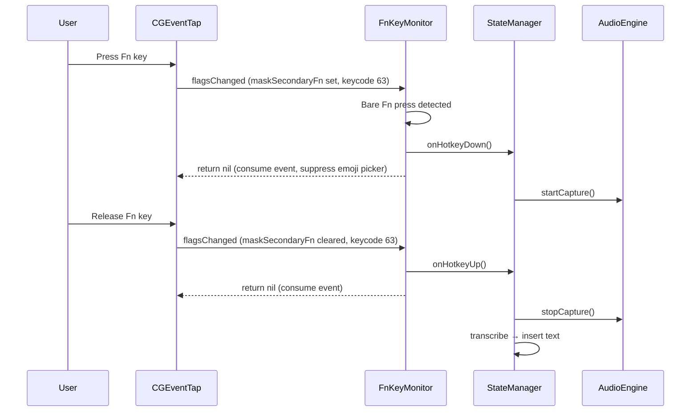

# Design Document: Fn Key as Hotkey (Issue #35)

## Overview

Add support for using the Fn (Globe) key as the dictation trigger in Wispr, as an alternative to the existing Carbon-based modifier+key hotkey. The Fn key cannot be captured through Carbon's `RegisterEventHotKey` API, so this feature requires a separate `CGEventTap`-based monitor that runs alongside (but mutually exclusive with) the existing `HotkeyMonitor`.

## Background: Why Fn Requires Special Handling

The Fn key is not a standard modifier in macOS:

- Carbon's `RegisterEventHotKey` only supports 4 modifiers: Cmd, Opt, Ctrl, Shift. Fn is invisible to this API.
- Fn/Globe is handled at the hardware level — it modifies scancodes before they enter the normal keyboard pipeline.
- On Apple Silicon Macs, the Fn key doubles as the Globe key, which by default opens the emoji/Character Viewer picker.
- The only way to intercept Fn globally is via `CGEventTap`, which sees raw keyboard events including `kVK_Function` (keycode 63) and `CGEventFlags.maskSecondaryFn`.

## Architecture

### Component Diagram

```
┌─────────────────────────────────────────────────┐
│                  StateManager                    │
│         onHotkeyDown / onHotkeyUp                │
└──────────────┬──────────────┬────────────────────┘
               │              │
    ┌──────────▼──┐    ┌──────▼──────────┐
    │HotkeyMonitor│    │ FnKeyMonitor    │
    │(Carbon API) │    │ (CGEventTap)    │
    │             │    │                 │
    │ Modifier+Key│    │ Fn press/release│
    └─────────────┘    └─────────────────┘
         ▲                    ▲
         │                    │
    Only one active at a time, controlled
    by SettingsStore.useFnKeyHotkey
```

### Key Design Decisions

1. **Separate class, not extending HotkeyMonitor**: The Carbon and CGEventTap APIs are fundamentally different. Mixing them in one class would create unnecessary complexity. `FnKeyMonitor` is a standalone `@MainActor` class with the same callback interface.

2. **Mutually exclusive activation**: Only one monitor runs at a time. The app init and settings observation logic activates/deactivates the appropriate monitor based on `useFnKeyHotkey`.

3. **Event consumption for bare Fn only**: The tap returns `nil` (consuming the event) only for bare Fn press/release. Any Fn+key combination (Fn+F1, Fn+Delete, etc.) is passed through unmodified to preserve standard macOS behavior.

4. **Conflict detection, not automatic resolution**: Wispr cannot programmatically change the Globe key system setting. Instead, it detects the conflict and shows a one-time warning with instructions.

## Components

### FnKeyMonitor

```swift
@MainActor
final class FnKeyMonitor {
    var onHotkeyDown: (() -> Void)?
    var onHotkeyUp: (() -> Void)?

    func start() throws
    func stop()
    func reregisterAfterWake()

    // Private
    private var eventTap: CFMachPort?
    private var runLoopSource: CFRunLoopSource?
    private var fnIsDown: Bool = false
    private var reEnableAttempts: Int = 0
}
```

**CGEventTap setup:**
- Event mask: `CGEventMask(1 << CGEventType.flagsChanged.rawValue)`
- Tap location: `kCGSessionEventTap` (session level, sufficient with Accessibility permission)
- Tap options: `kCGEventTapOptionDefault` (active, can modify/consume events)

**Event callback logic (C function via @convention(c)):**
```
on flagsChanged event:
    keycode = CGEventGetIntegerValueField(event, .keyboardEventKeycode)
    if keycode != 63 (kVK_Function):
        return event  // pass through, not Fn

    flags = CGEventGetFlags(event)
    fnDown = flags.contains(.maskSecondaryFn)

    // Check for Fn+key combos — pass through if other modifiers or keys are held
    otherModifiers = flags.intersection([.maskCommand, .maskAlternate, .maskControl, .maskShift])
    if !otherModifiers.isEmpty:
        return event  // Fn+modifier combo, don't intercept

    if fnDown and not previouslyDown:
        dispatch onHotkeyDown
        return nil  // consume to suppress emoji picker
    if not fnDown and previouslyDown:
        dispatch onHotkeyUp
        return nil  // consume

    return event
```

**Tap health monitoring:**
- Observe `CGEventTapIsEnabled()` — the system disables taps that take too long
- On `NSWorkspace.didWakeNotification`, call `CGEventTapEnable(tap, true)`
- If tap is disabled unexpectedly, re-enable up to 3 times, then fall back to HotkeyMonitor

### SettingsStore Additions

```swift
// New setting
var useFnKeyHotkey: Bool  // default: false, persisted to UserDefaults
```

### Settings UI Changes

The Hotkey section of SettingsView gains a mode selector:

```
┌─ Hotkey ─────────────────────────────────────┐
│                                               │
│  Activation Key   [Custom Hotkey ▾]           │
│                    ├─ Custom Hotkey            │
│                    └─ Fn (Globe) Key           │
│                                               │
│  ┌─ (shown when Custom Hotkey) ─────────┐    │
│  │  Current: ⌥Space    [Record New]     │    │
│  └──────────────────────────────────────┘    │
│                                               │
│  ⚠️ Globe key is set to open emoji picker.   │
│     Change it in System Settings → Keyboard.  │
│  (shown only when Fn mode + conflict)         │
│                                               │
└───────────────────────────────────────────────┘
```

### Globe Key Conflict Detection

Read `AppleFnUsageType` from UserDefaults:

```swift
let fnUsage = UserDefaults.standard.integer(forKey: "AppleFnUsageType")
// 0 = Show Emoji & Symbols (default on Apple Silicon)
// 1 = Do Nothing
// 2 = Show Character Viewer
// 3 = Change Input Source
let hasConflict = fnUsage == 0 || fnUsage == 2
```

Note: This reads from the global domain. The key is set by System Settings → Keyboard → "Press 🌐 key to".

### App Initialization & Settings Observation

In `wisprApp.swift`, the hotkey setup becomes:

```swift
if settingsStore.useFnKeyHotkey {
    try fnKeyMonitor.start()
    // Wire callbacks to StateManager
} else {
    try hotkeyMonitor.register(keyCode: ..., modifiers: ...)
    // Wire callbacks to StateManager
}
```

Settings observation watches `useFnKeyHotkey` and switches monitors on change.

## Data Flow: Fn Key Recording Session



## Risks and Mitigations

| Risk | Likelihood | Mitigation |
|------|-----------|------------|
| Emoji picker opens despite event consumption | Low — consuming the event should prevent it | Test on Apple Silicon Macs; if `flagsChanged` alone doesn't suppress it, also intercept `keyDown` for keycode 63 |
| Event tap disabled by system (callback too slow) | Low — callback is lightweight | Keep callback minimal (just flag check + dispatch); re-enable on detection |
| Fn+F-key combos broken | Medium if filter is wrong | Only consume events where keycode == 63 AND no other keys are held; pass through all combos |
| Users confused by Globe key conflict | High — it's the default on Apple Silicon | Proactive conflict detection with clear instructions |
| CGEventTap requires Accessibility permission | None — already required | No action needed |

## Testing Strategy

- **Unit tests**: `FnKeyMonitor` creation, start/stop lifecycle, callback wiring
- **Integration tests**: Switching between Fn and Custom hotkey modes, settings persistence
- **Manual tests**: Fn press/release detection, emoji picker suppression, Fn+F-key passthrough, system wake re-registration
- **Conflict detection tests**: Mock `AppleFnUsageType` values, verify warning shown/hidden

## Files to Create/Modify

| File | Action | Description |
|------|--------|-------------|
| `wispr/Services/FnKeyMonitor.swift` | Create | New CGEventTap-based Fn key monitor |
| `wispr/Services/SettingsStore.swift` | Modify | Add `useFnKeyHotkey` setting |
| `wispr/UI/Settings/SettingsView.swift` | Modify | Add Fn key mode selector, conflict warning |
| `wispr/wisprApp.swift` | Modify | Switch between FnKeyMonitor and HotkeyMonitor based on setting |
| `wisprTests/FnKeyMonitorTests.swift` | Create | Unit tests for FnKeyMonitor |
