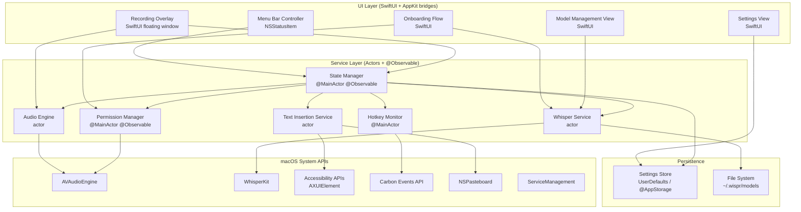
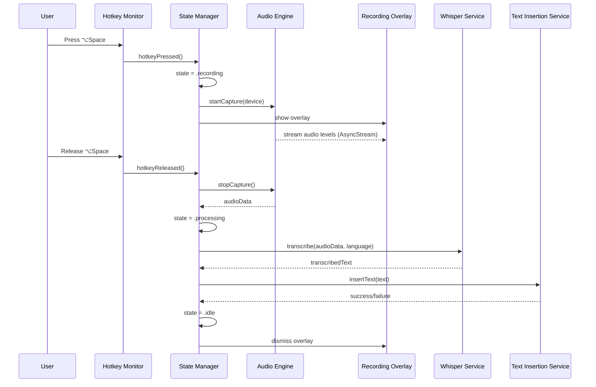

# Design Document: Wisp Voice Dictation

## Overview

Wisp is a privacy-first macOS 26 menu bar application that captures speech via the system microphone, transcribes it on-device using WhisperKit, and inserts the resulting text at the user's cursor position in any application. The app is activated via a configurable global hotkey (default ⌥Space) and lives entirely in the macOS menu bar with no Dock presence.

All processing is local — no audio data leaves the machine. The application is built with Swift 6, SwiftUI, Swift Concurrency (async/await, actors), the Observation framework (@Observable), and the swift-testing framework. No Objective-C bridging, no GCD, no Combine for async flows, and no XCTest.

### Key Design Decisions

1. **Actor-based concurrency model**: Each service that manages mutable state is modeled as a Swift actor, ensuring data-race safety under Swift 6 strict concurrency. The `StateManager` is a `@MainActor`-isolated `@Observable` class since it drives UI updates.
2. **Structured concurrency only**: All concurrent operations use structured concurrency patterns (async let, TaskGroup, AsyncStream). Task {} inside AsyncStream closures is permitted as it represents structured concurrency - the task is scoped to the stream's lifetime with automatic cancellation when the stream is dropped. Task.detached {} is prohibited. This pattern is used in PermissionManager (polling) and AudioEngine (bridging sync callbacks to async actor methods).
3. **WhisperKit over whisper.cpp**: WhisperKit provides a native Swift API with CoreML acceleration on Apple Silicon, aligning with the pure-Swift constraint.
4. **Carbon Event APIs for global hotkeys**: SwiftUI and AppKit have no built-in global hotkey API. Carbon's `RegisterEventHotKey` is the only stable macOS API for system-wide hotkey registration. This is one of the few places where legacy C API bridging is unavoidable.
5. **Accessibility API with clipboard fallback for text insertion**: Primary insertion uses `AXUIElement` APIs. When the frontmost app doesn't support AX text insertion, we fall back to pasteboard + simulated ⌘V, restoring the original pasteboard contents afterward.
6. **Menu bar-only app (LSUIElement)**: The app sets `NSApplication.ActivationPolicy.accessory` so it never appears in the Dock.
7. **Liquid Glass design language**: All overlay and popover surfaces use `.ultraThinMaterial` / `.regularMaterial` with macOS 26 Tahoe Liquid Glass aesthetics, respecting Reduce Transparency for accessibility.
8. **Xcode MCP tool for all development operations**: All file operations, builds, tests, and debugging will be performed through the Xcode MCP tool to maintain consistency with Xcode's project model and leverage native IDE capabilities.

## Architecture

### High-Level Architecture



### Data Flow: Recording → Transcription → Insertion



### Concurrency Model

| Component | Isolation | Rationale |
|-----------|-----------|-----------|
| `StateManager` | `@MainActor` | Drives UI state, must be main-thread safe |
| `AudioEngine` | `actor` | Manages AVAudioEngine lifecycle, mutable buffers |
| `WhisperService` | `actor` | Manages WhisperKit instance, model loading |
| `TextInsertionService` | `actor` | Serializes AX/pasteboard operations |
| `HotkeyMonitor` | `@MainActor` | Carbon event handlers run on main thread |
| `PermissionManager` | `@MainActor` | Permission dialogs are main-thread |
| `SettingsStore` | `@MainActor` | UserDefaults access, drives UI |

All inter-actor communication uses `async/await`. Audio level streaming from `AudioEngine` to the `RecordingOverlay` uses `AsyncStream<Float>`.


## Components and Interfaces

### 1. StateManager

The central coordinator. It is a `@MainActor @Observable` class that owns the application state machine and orchestrates all services.

```swift
@MainActor
@Observable
final class StateManager {
    // MARK: - Published State
    var appState: AppStateType = .idle
    var errorMessage: String?
    var currentLanguage: TranscriptionLanguage = .autoDetect

    // MARK: - Dependencies
    private let audioEngine: AudioEngine
    private let whisperService: WhisperService
    private let textInsertionService: TextInsertionService
    private let hotkeyMonitor: HotkeyMonitor
    private let permissionManager: PermissionManager
    private let settingsStore: SettingsStore

    // MARK: - State Machine
    func beginRecording() async
    func endRecording() async
    func handleError(_ error: WispError) async
    func resetToIdle() async
}

enum AppStateType: Sendable {
    case idle
    case recording
    case processing
    case error(String)
}
```

### 2. AudioEngine

An actor that wraps `AVAudioEngine` for microphone capture. Provides an `AsyncStream<Float>` of audio levels for the overlay waveform.

```swift
actor AudioEngine {
    // MARK: - State
    private var engine: AVAudioEngine?
    private var audioBuffer: [Float] = []
    private var levelContinuation: AsyncStream<Float>.Continuation?

    // MARK: - Configuration
    func setInputDevice(_ deviceID: AudioDeviceID) throws
    func availableInputDevices() -> [AudioInputDevice]

    // MARK: - Recording
    func startCapture() async throws -> AsyncStream<Float>
    func stopCapture() async -> Data
    func cancelCapture() async

    // MARK: - Device Monitoring
    func startDeviceMonitoring() async
}

struct AudioInputDevice: Identifiable, Sendable, Codable {
    let id: AudioDeviceID
    let name: String
    let uid: String
}
```

### 3. WhisperService

An actor managing WhisperKit model lifecycle, downloads, and transcription. Downloaded models are stored under `~/.wispr/models/argmaxinc/whisperkit-coreml/<variant>/` — a fixed, user-visible location independent of App Sandbox or HubApi defaults.

```swift
actor WhisperService {
    // MARK: - State
    private var whisperKit: WhisperKit?
    private var activeModelName: String?
    private var downloadTasks: [String: Task<Void, Error>] = [:]

    // MARK: - Model Management
    func availableModels() -> [WhisperModelInfo]
    func downloadModel(_ model: WhisperModelInfo, progress: @Sendable (DownloadProgress) -> Void) async throws
    func deleteModel(_ modelName: String) async throws
    func loadModel(_ modelName: String) async throws
    func switchModel(to modelName: String) async throws
    func validateModelIntegrity(_ modelName: String) async throws -> Bool

    // MARK: - Transcription
    func transcribe(_ audioData: Data, language: TranscriptionLanguage) async throws -> TranscriptionResult

    // MARK: - Queries
    func modelStatus(_ modelName: String) async -> ModelStatus
    func activeModel() async -> String?
}

struct WhisperModelInfo: Identifiable, Sendable {
    let id: String          // e.g. "tiny"
    let displayName: String // e.g. "Tiny"
    let sizeDescription: String // e.g. "~75 MB"
    var status: ModelStatus
}

enum ModelStatus: Sendable {
    case notDownloaded
    case downloading(progress: Double)
    case downloaded
    case active
}

struct DownloadProgress: Sendable {
    let fractionCompleted: Double
    let bytesDownloaded: Int64
    let totalBytes: Int64
}

struct TranscriptionResult: Sendable {
    let text: String
    let detectedLanguage: String?
}

enum TranscriptionLanguage: Sendable, Codable {
    case autoDetect
    case specific(code: String)
    case pinned(code: String)
}
```

### 4. TextInsertionService

An actor that handles inserting transcribed text at the cursor position.

```swift
actor TextInsertionService {
    // MARK: - Insertion
    func insertText(_ text: String) async throws
    
    // MARK: - Private
    private func insertViaAccessibility(_ text: String) throws
    private func insertViaClipboard(_ text: String) async throws
    private func restorePasteboard(_ contents: [NSPasteboard.PasteboardType: Data], after: Duration) async
}
```

### 5. HotkeyMonitor

A `@MainActor` class that registers/unregisters Carbon global hotkeys.

```swift
@MainActor
final class HotkeyMonitor {
    var onHotkeyDown: (() -> Void)?
    var onHotkeyUp: (() -> Void)?

    func register(keyCode: UInt32, modifiers: UInt32) throws
    func unregister()
    func updateHotkey(keyCode: UInt32, modifiers: UInt32) throws
    func verifyRegistration() -> Bool
}
```

### 6. PermissionManager

A `@MainActor @Observable` class that checks and requests macOS permissions.

```swift
@MainActor
@Observable
final class PermissionManager {
    var microphoneStatus: PermissionStatus = .notDetermined
    var accessibilityStatus: PermissionStatus = .notDetermined

    var allPermissionsGranted: Bool { 
        microphoneStatus == .authorized && accessibilityStatus == .authorized 
    }

    func checkPermissions()
    func requestMicrophoneAccess() async -> Bool
    func openAccessibilitySettings()
    func startMonitoringPermissionChanges() async
}

enum PermissionStatus: Sendable {
    case notDetermined
    case denied
    case authorized
}
```

### 7. SettingsStore

A `@MainActor @Observable` class backed by `UserDefaults` for all persistent preferences.

```swift
@MainActor
@Observable
final class SettingsStore {
    // Hotkey
    var hotkeyKeyCode: UInt32 = 49       // Space
    var hotkeyModifiers: UInt32 = 2048   // Option
    
    // Audio
    var selectedAudioDeviceUID: String?
    
    // Model
    var activeModelName: String = "tiny"
    
    // Language
    var languageMode: TranscriptionLanguage = .autoDetect
    
    // General
    var launchAtLogin: Bool = false
    var onboardingCompleted: Bool = false
    
    // Persistence
    func save()
    func load()
}
```

### 8. UI Components

#### MenuBarController
Manages the `NSStatusItem`, template icon, and dropdown menu. Bridges to SwiftUI views for settings, model management, and language selection.

#### RecordingOverlay
A borderless, floating `NSPanel` hosting a SwiftUI view. Displays:
- Real-time audio waveform/level meter (driven by `AsyncStream<Float>` from `AudioEngine`)
- Recording state indicator
- Processing spinner
- Error messages (auto-dismiss after 3 seconds)

Uses Liquid Glass materials, spring animations (≤300ms), and respects Reduce Motion / Reduce Transparency.

#### OnboardingFlow
A multi-step wizard presented as a dedicated window on first launch:
1. Welcome
2. Microphone permission
3. Accessibility permission
4. Model selection + download
5. Test dictation
6. Completion

Step indicator shows progress. Continue is disabled until required steps complete. Resumes from last incomplete step if force-quit.

#### SettingsView
SwiftUI `Form` with sections: Hotkey Configuration, Audio Device, Whisper Model, Language, General. All changes apply immediately.

#### ModelManagementView
Lists all available Whisper models with status (not downloaded / downloading % / downloaded / active). Supports download, delete, and switch-active actions.


## Development Workflow with Xcode MCP Tool

### Overview

The USER will manually create the initial Xcode project and skeleton app structure. Implementation will START FROM this existing project by first discovering the project structure using the Xcode MCP tool, then proceeding with all development operations.

All development operations for Wisp will be performed through the Xcode MCP tool, which provides integrated access to Xcode's native capabilities for file management, building, testing, and debugging. This ensures consistency with Xcode's project model and leverages the IDE's understanding of Swift project structure.

### File Operations

All file creation and modification operations will use the Xcode MCP tool:

- **Creating new Swift files**: Use Xcode MCP tool to create files within the appropriate target and group structure
- **Modifying existing files**: Use Xcode MCP tool for all code edits to maintain Xcode's index and project state
- **Organizing files**: Use Xcode MCP tool to create groups, move files between groups, and manage project structure
- **Adding resources**: Use Xcode MCP tool to add asset catalogs, Info.plist entries, and other resources

The implementation SHALL NOT bypass Xcode by directly manipulating files in the filesystem, as this can desynchronize Xcode's project model.

### Build Workflow

The Xcode MCP tool will handle all build operations:

1. **Dependency Resolution**: Use Xcode MCP tool to add Swift Package Manager dependencies (WhisperKit, swift-testing) and resolve package versions
2. **Compilation**: Use Xcode MCP tool to build the application target, which handles:
   - Swift 6 compilation with strict concurrency checking
   - Asset catalog compilation
   - Info.plist processing
   - Code signing
3. **Build Configuration**: Use Xcode MCP tool to configure build settings:
   - Set minimum deployment target to macOS 26
   - Enable Swift 6 strict concurrency
   - Configure code signing for menu bar app distribution
   - Set `LSUIElement` in Info.plist for menu bar-only presence
4. **Diagnostic Retrieval**: When compilation errors occur, use Xcode MCP tool to retrieve detailed diagnostics including file location, error message, and fix-it suggestions

### Testing Workflow

The Xcode MCP tool will manage all testing operations:

1. **Test Discovery**: Use Xcode MCP tool to discover swift-testing test suites across the project
2. **Test Execution**: Use Xcode MCP tool to run tests, which provides:
   - Parallel test execution
   - Test result reporting
   - Failure diagnostics with source locations
   - Performance metrics
3. **Test Configuration**: Use Xcode MCP tool to configure test plans, including:
   - Test target membership
   - Test execution order
   - Environment variables for testing
4. **Continuous Testing**: Use Xcode MCP tool to run tests after each significant code change to catch regressions early

### Debugging Workflow

The Xcode MCP tool will support debugging operations:

1. **Breakpoint Management**: Use Xcode MCP tool to set breakpoints in Swift source files at specific lines or function entry points
2. **Variable Inspection**: Use Xcode MCP tool to inspect variable values, actor state, and object hierarchies during debugging sessions
3. **Runtime Analysis**: Use Xcode MCP tool to analyze:
   - Memory usage and leaks
   - Thread sanitizer reports for data races
   - Performance profiling
4. **Crash Analysis**: Use Xcode MCP tool to analyze crash logs and symbolicate stack traces

### Project Structure Discovery

**This is the STARTING POINT of implementation.** The user will have already created the Xcode project and basic app skeleton. Implementation begins by discovering what exists:

1. **Project Discovery**: Use Xcode MCP tool to discover the existing Xcode project structure, including:
   - Project file location (.xcodeproj)
   - Existing targets and schemes
   - Current file organization
   - Existing dependencies
2. **Target Configuration**: Use Xcode MCP tool to verify target settings:
   - Bundle identifier
   - Deployment target
   - Swift version
   - Entitlements (microphone, accessibility)

After discovery, proceed with implementation by adding files, dependencies, and functionality to the existing project structure.

### Architectural Considerations for Xcode MCP Tool Constraints

The development workflow must account for Xcode MCP tool integration:

1. **Incremental Development**: Build and test frequently using Xcode MCP tool to catch issues early in the development cycle
2. **File Organization**: Organize files in logical groups within Xcode that mirror the architectural layers (UI, Services, Models, System Integrations)
3. **Modular Testing**: Structure code to enable testing individual components through swift-testing, executed via Xcode MCP tool
4. **Build Time Optimization**: Organize code to minimize rebuild times when using Xcode MCP tool for iterative development
5. **Dependency Management**: Use Xcode MCP tool to manage Swift Package Manager dependencies, ensuring version resolution and compatibility

### Integration Points

The Xcode MCP tool will be used at these key integration points:

| Development Phase | Xcode MCP Tool Usage |
|-------------------|---------------------|
| Project Setup | Discover project structure, configure targets, add dependencies |
| Implementation | Create files, write code, organize project structure |
| Compilation | Build targets, resolve dependencies, retrieve diagnostics |
| Testing | Run swift-testing suites, analyze test results |
| Debugging | Set breakpoints, inspect state, analyze runtime behavior |
| Iteration | Modify code, rebuild, retest in rapid cycles |

## Data Models

### Application State

```swift
enum AppStateType: Sendable, Equatable {
    case idle
    case recording
    case processing
    case error(String)
}
```

### Recording Session

```swift
struct RecordingSession: Sendable {
    let id: UUID
    let startTime: Date
    let deviceUID: String
    var audioData: Data?
}
```

### Whisper Models

```swift
struct WhisperModelInfo: Identifiable, Sendable, Equatable {
    let id: String              // e.g. "tiny"
    let displayName: String     // e.g. "Tiny"
    let sizeDescription: String // e.g. "~75 MB"
    let qualityDescription: String // e.g. "Fastest, lower accuracy"
    var status: ModelStatus
}

enum ModelStatus: Sendable, Equatable {
    case notDownloaded
    case downloading(progress: Double)
    case downloaded
    case active
}

struct DownloadProgress: Sendable {
    let fractionCompleted: Double
    let bytesDownloaded: Int64
    let totalBytes: Int64
}
```

### Transcription

```swift
struct TranscriptionResult: Sendable, Equatable {
    let text: String
    let detectedLanguage: String?
    let duration: TimeInterval
}

enum TranscriptionLanguage: Sendable, Codable, Equatable {
    case autoDetect
    case specific(code: String)
    case pinned(code: String)
    
    var isAutoDetect: Bool {
        if case .autoDetect = self { return true }
        return false
    }
    
    var isPinned: Bool {
        if case .pinned = self { return true }
        return false
    }
    
    var languageCode: String? {
        switch self {
        case .autoDetect: return nil
        case .specific(let code), .pinned(let code): return code
        }
    }
}
```

### Audio Devices

```swift
struct AudioInputDevice: Identifiable, Sendable, Codable, Equatable {
    let id: UInt32  // AudioDeviceID
    let name: String
    let uid: String
}
```

### Permissions

```swift
enum PermissionStatus: Sendable, Equatable {
    case notDetermined
    case denied
    case authorized
}
```

### Settings Persistence

All settings are stored in `UserDefaults` via the `SettingsStore`. The keys:

| Key | Type | Default | Description |
|-----|------|---------|-------------|
| `hotkeyKeyCode` | `UInt32` | `49` (Space) | Virtual key code |
| `hotkeyModifiers` | `UInt32` | `2048` (Option) | Carbon modifier flags |
| `selectedAudioDeviceUID` | `String?` | `nil` (system default) | Preferred mic UID |
| `activeModelName` | `String` | `"tiny"` | Active Whisper model |
| `languageMode` | `TranscriptionLanguage` | `.autoDetect` | Language selection |
| `launchAtLogin` | `Bool` | `false` | Auto-start at login |
| `onboardingCompleted` | `Bool` | `false` | First-launch flag |
| `onboardingLastStep` | `Int` | `0` | Resume point for interrupted onboarding |

### Error Types

```swift
enum WispError: Error, Sendable, Equatable {
    // Permissions
    case microphonePermissionDenied
    case accessibilityPermissionDenied
    
    // Audio
    case noAudioDeviceAvailable
    case audioDeviceDisconnected
    case audioRecordingFailed(String)
    
    // Transcription
    case modelLoadFailed(String)
    case modelNotDownloaded
    case transcriptionFailed(String)
    case emptyTranscription
    
    // Text Insertion
    case textInsertionFailed(String)
    
    // Hotkey
    case hotkeyConflict(String)
    case hotkeyRegistrationFailed
    
    // Model Management
    case modelDownloadFailed(String)
    case modelValidationFailed(String)
    case modelDeletionFailed(String)
    case noModelsAvailable
}
```

### Onboarding State

```swift
enum OnboardingStep: Int, Sendable, CaseIterable {
    case welcome = 0
    case microphonePermission = 1
    case accessibilityPermission = 2
    case modelSelection = 3
    case testDictation = 4
    case completion = 5
    
    var isSkippable: Bool {
        self == .testDictation
    }
    
    var isRequired: Bool {
        switch self {
        case .microphonePermission, .accessibilityPermission, .modelSelection:
            return true
        default:
            return false
        }
    }
}
```

